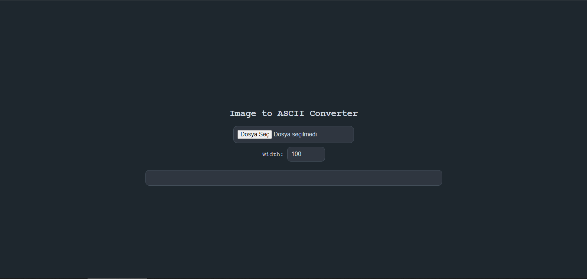

# Image to ASCII Converter

This is a simple web application that converts images to ASCII art. You can upload an image, specify the desired width for the output, and see the ASCII art representation of the image.

## Features

- Upload an image and convert it to ASCII art.
- Specify the width of the ASCII art.
- Responsive design with a dark theme and rounded corners.

## Usage

1. Clone the repository or download the files.
2. Open `index.html` in your web browser.
3. Upload an image using the file input.
4. Adjust the width as needed using the number input.
5. The ASCII art will be displayed on the page.

## Files

- `index.html`: The main HTML file containing the structure and functionality of the application.
- `styles.css`: The CSS file containing the styles for the application.
- `script.js`: The JavaScript file containing the logic for converting images to ASCII art.

## Screenshot

## License

This project is licensed under the MIT License.
